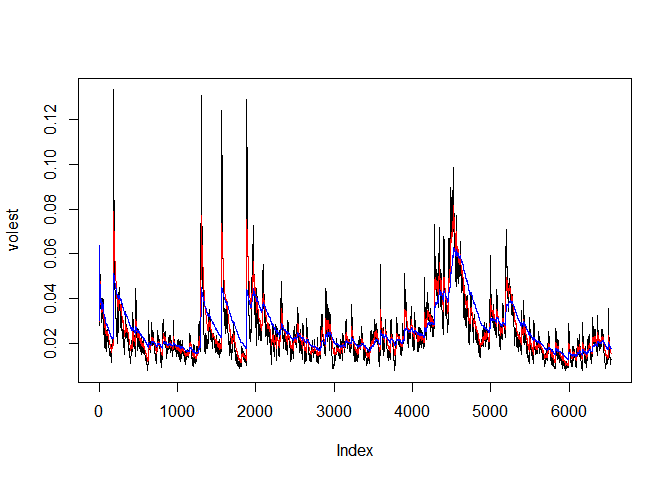
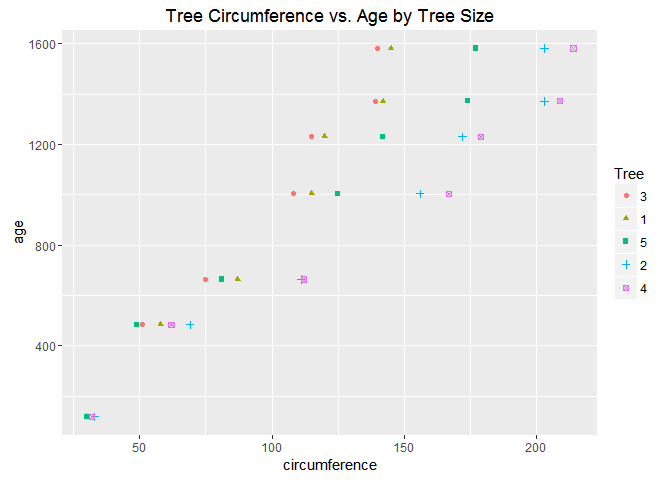
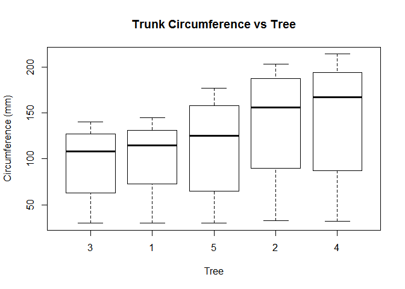
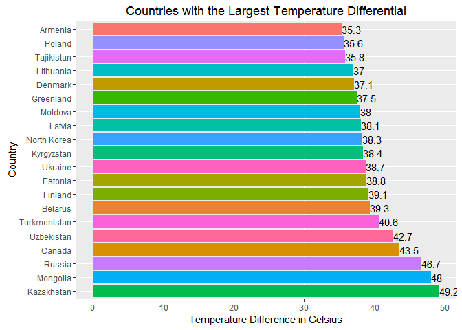
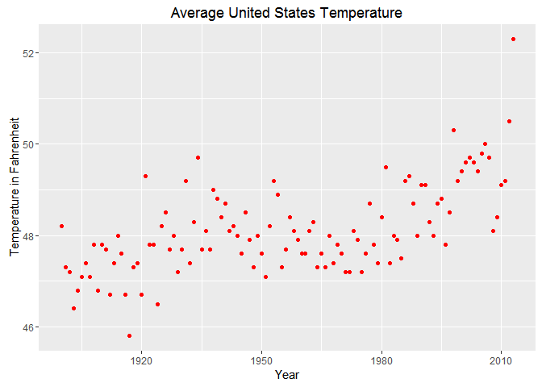
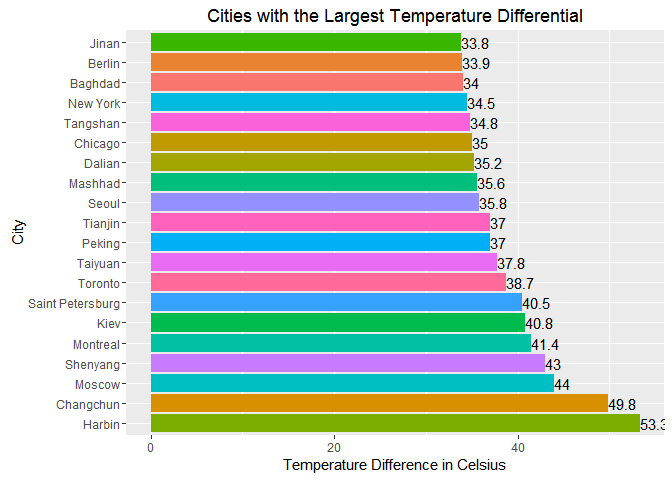

# CaseStudy2
Jacob Brionez Glenn Oswald Will Nichol  
December 8, 2016  
#Question 01 (10 points)
 
###Create the X matrix and print it from SAS, R, and Python.

####SAS code

proc iml;

reset print;

X= {4 5 1 2, 1 0 3 5, 2 1 8 2};

quit;
 
 
 
 

 
####R code


```r
x <- c(4, 1, 2, 5, 0, 1, 1, 3, 8, 2,  5, 2)
dim(x) <- c(3,4)
x
```

```
##      [,1] [,2] [,3] [,4]
## [1,]    4    5    1    2
## [2,]    1    0    3    5
## [3,]    2    1    8    2
```

####Python Code


 x = [[4, 5, 1, 2], [1, 0, 3, 5], [2, 1, 8, 2]]
 
for row in x:

print (row)


[4, 5, 1, 2]

[1, 0, 3, 5]

[2, 1, 8, 2]

#Question 02 (15 points)

Please watch  videos 1 and 2 in week 11 lecture assignment. You can download the code which used for S&P from files tab.

Please do the following with your assigned stock.

•	Download the data.

•	Calculate log returns.

•	Calculate volatility measure.

•	Calculate volatility over entire length of series for various three different decay factors.

•	Plot the results, overlaying the volatility curves on the data, just as was done in the S&P example.

Will, Jacob and Glenn	LNN


```r
library(tseries)
```

```
## Warning: package 'tseries' was built under R version 3.3.2
```

```r
library(ggplot2)

#Download the data.
#Calculate log returns.

SNPdata <- get.hist.quote('lnn',quote="Close")#download the stock LNN data
SNPret <- log(lag(SNPdata)) - log(SNPdata)#Log return calc
SNPvol <- sd(SNPret) * sqrt(250) * 100

#Calculate volatility measure.

get
```

```
## function (x, pos = -1L, envir = as.environment(pos), mode = "any", 
##     inherits = TRUE) 
## .Internal(get(x, envir, mode, inherits))
## <bytecode: 0x0000000013946268>
## <environment: namespace:base>
```

```r
Vol <- function(d, logrets)
{
	var = 0
	lam = 0
	varlist <- c()
	for (r in logrets) {
		lam = lam*(1 - 1/d) + 1
	var = (1 - 1/lam)*var + (1/lam)*r^2
		varlist <- c(varlist, var)
	}
	sqrt(varlist)
}

#Recreate Figure 6.12 in the text on page 155

volest <- Vol(10,SNPret) #decay factor of 10
volest2 <- Vol(30,SNPret) #decay factor of 20
volest3 <- Vol(100,SNPret) #decay factor of 30
plot(volest,type="l")
lines(volest2,type="l",col="red")
lines(volest3, type = "l", col="blue")
```

<!-- -->

#Question 03 (20 points)

The built-in data set called Orange in R is about the growth of orange trees. The Orange data frame has 3 columns of records of the growth of orange trees.
 
Variable description

Tree : an ordered factor indicating the tree on which the measurement is made. The ordering is according to increasing maximum diameter.
 
age :  a numeric vector giving the age of the tree (days since 1968/12/31)
circumference :  a numeric vector of trunk circumferences (mm). This is probably “circumference at breast height”, a standard measurement in forestry.


####Calculate the mean and the median of the trunk circumferences for different size of the trees. 

```r
#The mean circumference is calculated Using the aggregate function and the results are put into a new data frame AvgCirc 
AvgCirc <- aggregate(Orange$circumference, by = list(Orange$Tree), mean)


#The median circumference is calculated Using the aggregate function and the results are put into a new data frame MedCirc
MedCirc <- aggregate(Orange$circumference, by = list(Orange$Tree), median)


#The two data frames are merged using the merge function by the Group.1 variable
TreeData <- merge(x=AvgCirc, y=MedCirc, by="Group.1", all=TRUE)
#The variables are renamed to more descriptive titles
colnames(TreeData) <- c("Tree","MeanCircumference", "MedianCircumference")
TreeData
```

```
##   Tree MeanCircumference MedianCircumference
## 1    1          99.57143                 115
## 2    2         135.28571                 156
## 3    3          94.00000                 108
## 4    4         139.28571                 167
## 5    5         111.14286                 125
```

####Make a scatter plot of the trunk circumferences against the age of the tree. Use different plotting symbols for different size of trees.


```r
TreePlot <- ggplot(Orange, aes(x=circumference, y=age, group=Tree))+geom_point(aes(shape=Tree, color=Tree))
TreePlot+ggtitle("Tree Circumference vs. Age by Tree Size")
```

<!-- -->

####Display the trunk circumferences on a comparative boxplot against tree. Be sure you order the boxplots in the increasing order of maximum diameter.


```r
boxplot(circumference~Tree, data=Orange, main="Trunk Circumference vs Tree", xlab="Tree", ylab="Circumference (mm)")
```

<!-- -->

#Question 04 (45 points)

Download “Temp” data set (check your SMU email)

####(i)	Find the difference between the maximum and the minimum monthly average temperatures for each country and report/visualize top 20 countries with the maximum differences for the period since 1900.


```r
library(lubridate)
```

```
## 
## Attaching package: 'lubridate'
```

```
## The following object is masked from 'package:base':
## 
##     date
```

```r
library(ggplot2)
library(plyr)
```

```
## 
## Attaching package: 'plyr'
```

```
## The following object is masked from 'package:lubridate':
## 
##     here
```

```r
library(dplyr)
```

```
## 
## Attaching package: 'dplyr'
```

```
## The following objects are masked from 'package:plyr':
## 
##     arrange, count, desc, failwith, id, mutate, rename, summarise,
##     summarize
```

```
## The following objects are masked from 'package:lubridate':
## 
##     intersect, setdiff, union
```

```
## The following objects are masked from 'package:stats':
## 
##     filter, lag
```

```
## The following objects are masked from 'package:base':
## 
##     intersect, setdiff, setequal, union
```

```r
#Reads the Temp.CSV file into a data frame TempDataRaw
TempDataRaw <- read.csv("C:/Users/Jacob/.spyder-py3/TEMP.csv", header=TRUE, sep=",", na.strings=c("","NA"))

#Puts the TempDataRaw into a new data frame TempData and saves the raw version unmoddified
TempData <- TempDataRaw


#Convert dates as factor to date variable type
TempData$Date <- as.Date(TempData$Date, format = "%m/%d/%Y")
#Convert date to POSIXlt date format; the POSIXlt is from the lubridate package
#The POSIXlt date format will make it easier to create a new month or year varibles that we can use as a categorical variable
TempData$Date <- as.POSIXlt(TempData$Date)

#Check for missing values in the Date variable
#There are 245,720 observation that are NA
sum(is.na(TempData$Date))
```

```
## [1] 245720
```

```r
#Remove NA observations from the Date variable
TempData <- TempData[!is.na(TempData$Date),]

#Renumber the TempData data frame so future indexing will be correct (if used)
rownames(TempData) <- 1:nrow(TempData)

#Rename the variables in camel case and shorten to make more readable
colnames(TempData) <- c("Date","MonthlyAvgTemp","MonthlyAveTempUncert","Country")

#Check for missing values in the MonthlyAvgTemp variable
#The NA values must be removed so the aggregate function below works correctly
#There are 1049 observation that are NA
sum(is.na(TempData$MonthlyAvgTemp))
```

```
## [1] 1049
```

```r
#Remove NA observations in Date variable from the data frame
TempData <- TempData[!is.na(TempData$MonthlyAvgTemp),]

#Renumber the TempData data frame so future indexing will be correct (if used)
rownames(TempData) <- 1:nrow(TempData)

#Creates a new data frame UStemp for question ii
UStemp <- TempData

#The max and min are calculated using the aggregate function and the results are put into new data frames
TempDataMax <- aggregate(TempData$MonthlyAvgTemp, by = list(TempData$Country), max)
TempDataMin <- aggregate(TempData$MonthlyAvgTemp, by = list(TempData$Country), min)

#All observations are merged and the resulting data is sorted by the CountryCode
TempDataDiff <- merge(x=TempDataMax, y=TempDataMin, by="Group.1", all=TRUE)

#Creates the new variable with all observations set to NA
TempDataDiff$Difference <- NA
#Changes the variable type to numeric
TempDataDiff$Difference <- as.numeric(TempDataDiff$Difference)

#Rename the variables to match the TempData data frame
colnames(TempDataDiff) <- c("Country","Max","Min","Difference")

#Computes the difference between the max and min and stores it in the difference variable
TempDataDiff$Difference <- TempDataDiff$Max - TempDataDiff$Min

#Order TempDataDiff by the Difference variable decreasing
TempDataDiff <- TempDataDiff[order(TempDataDiff$Difference, decreasing = TRUE),]

#Round to 1 digit
TempDataDiff$Difference <- round(TempDataDiff$Difference, digits=1)

#Renumber the TempDataDiff data frame so future indexing will be correct (if used)
rownames(TempDataDiff) <- 1:nrow(TempDataDiff)

#Subset the TempDataDiff variable to include only the top 20
TempDataDiff <- TempDataDiff[1:20,]

DiffPlot <- ggplot(TempDataDiff, aes(x=TempDataDiff$Country, y=TempDataDiff$Difference, fill=TempDataDiff$Country))
DiffPlot <- DiffPlot + aes(x=reorder(TempDataDiff$Country, -TempDataDiff$Difference))
DiffPlot <- DiffPlot + geom_text(aes(label=TempDataDiff$Difference, hjust=.0001))
DiffPlot <- DiffPlot + geom_bar(stat="identity") + guides(fill=FALSE)
DiffPlot <- DiffPlot + ggtitle("Countries with the Largest Temperature Differential")
DiffPlot <- DiffPlot + xlab("Country")
DiffPlot <- DiffPlot + ylab("Temperature Difference in Celsius")
DiffPlot <- DiffPlot + coord_flip()
DiffPlot
```

<!-- -->

####(ii)  Select a subset of data called “UStemp” where US land temperatures from 01/01/1990 in Temp data. Use UStemp dataset to answer the followings.

####a) Create a new column to display the monthly average land temperatures in Fahrenheit (°F).


```r
UStemp <- UStemp[which(UStemp$Country=="United States"),]
#Creates the new variable with all observations set to NA
UStemp$MonthlyAvgTempF <- NA
#Changes the variable type to numeric
UStemp$MonthlyAvgTempF <- as.numeric(UStemp$MonthlyAvgTempF)
#Computes the Monthly Average Temperature in Farenheit and stores it in the MonthlyAvgTempF variable
#Rounds to 3 digits
UStemp$MonthlyAvgTempF <- round(UStemp$MonthlyAvgTemp * 1.8 + 32, digits=3)
```

####b) Calculate average land temperature by year and plot it. The original file has the average land temperature by month.


```r
#Creates the new variable with all observations set to NA
UStemp$Year <- NA
#Changes the variable type to POSIXlt
UStemp$Year <- as.POSIXlt(UStemp$Year)
#Extracts the month from the date and sets the Month variable
#Uses the year function from the lubridate package
UStemp$Year <- year(UStemp$Date) 

#Aggregates the MonthlyAvgTempF by year and puts it into new data frame UStempAvg
UStempAvg <- aggregate(UStemp$MonthlyAvgTempF, by = list(UStemp$Year), mean)

#Rename the variables to match the UStemp data frame
colnames(UStempAvg) <- c("Year","YearlyAvgTempF")

#Rounds the temp to 1 digits
UStempAvg$YearlyAvgTempF <- round(UStempAvg$YearlyAvgTempF, digits=1)

AvgPlot <- ggplot(UStempAvg, aes(x=UStempAvg$Year, y=UStempAvg$YearlyAvgTempF))
AvgPlot <- AvgPlot + geom_point(color="red")
AvgPlot <- AvgPlot + ggtitle("Average United States Temperature")
AvgPlot <- AvgPlot + xlab("Year")
AvgPlot <- AvgPlot + ylab("Temperature in Fahrenheit")
AvgPlot
```

<!-- -->

####c) Calculate the one year difference of average land temperature by year and provide the maximum difference (value) with corresponding two years.
 
(for example, year 2000: add all 12 monthly averages and divide by 12 to get average temperature in 2000. You can do the same thing for all the available years. Then you can calculate the one year difference as 1991-1990, 1992-1991, etc)


```r
#Creates the new variable with all observations set to NA
UStempAvg$YearlyAvgTempFChange <- NA
#Changes the variable type to numeric
UStempAvg$YearlyAvgTempFChange <- as.numeric(UStempAvg$YearlyAvgTempFChange)

#Calculates the difference between each observation in the data frame
#The diff function requires a matrix or vector so the YearlyAvgTempF is called as a vector using the as.vector function
#The diff function returns a vector with 113 observations which is the number of differences
#So the replacement vector must be put into the 2:114 observations leaving the 1st observation as NA
UStempAvg$YearlyAvgTempFChange[2:114] <- diff(as.vector(UStempAvg$YearlyAvgTempF))
#Select the observation that has the largest temperature change and put into a variable MaxChange
MaxChange = max(range(UStempAvg$YearlyAvgTempFChange, na.rm = TRUE))
```

Observations for the temperature differential


```r
UStempAvg[which(UStempAvg$YearlyAvgTempFChange==MaxChange)-1,]
```

```
##    Year YearlyAvgTempF YearlyAvgTempFChange
## 21 1920           46.7                 -0.7
```

```r
UStempAvg[which(UStempAvg$YearlyAvgTempFChange==MaxChange),]
```

```
##    Year YearlyAvgTempF YearlyAvgTempFChange
## 22 1921           49.3                  2.6
```


####(iii) Find the difference between the maximum and the minimum temperatures for each major city and report/visualize top 20 cities with maximum differences for the period since 1900.

Download “CityTemp” data set (check your SMU email).


```r
#Reads the CityTemp.CSV file into a data frame CityTempDataRaw
CityTempDataRaw <- read.csv("C:/Users/Jacob/.spyder-py3/CITYTEMP.csv", header=TRUE, sep=",", na.strings=c("","NA"))

#Puts the CityTempDataRaw into a new data frame TempData and saves the raw version unmoddified
CityTempData <- CityTempDataRaw

#Convert dates as factor to date variable type
CityTempData$Date <- as.Date(CityTempData$Date, format = "%m/%d/%Y")
#Convert date to POSIXlt date format; the POSIXlt is from the lubridate package
#The POSIXlt date format will make it easier to create a new month or year varibles that we can use as a categorical variable
CityTempData$Date <- as.POSIXlt(CityTempData$Date)

#Check for missing values in the Date variable
#There are 102,065 observation that are NA
sum(is.na(CityTempData$Date))
```

```
## [1] 102065
```

```r
#Remove NA observations from the Date variable
CityTempData <- CityTempData[!is.na(CityTempData$Date),]

#Renumber the CityTempData data frame so future indexing will be correct (if used)
rownames(CityTempData) <- 1:nrow(CityTempData)

#Rename the variables in camel case and shorten to make more readable
colnames(CityTempData) <- c("Date","MonthlyAvgTemp","MonthlyAveTempUncert","City","Country","Latitude","Longitute")

#Remove colums 6 and 7 as they are unused in the analysis
CityTempData <- CityTempData[,-(6:7)]

#Check for missing values in the MonthlyAvgTemp variable
#The NA values must be removed so the aggregate function below works correctly
#There are 92 observation that are NA
sum(is.na(CityTempData$MonthlyAvgTemp))
```

```
## [1] 92
```

```r
#Remove NA observations in Date variable from the data frame
CityTempData <- CityTempData[!is.na(CityTempData$MonthlyAvgTemp),]

#Renumber the CityTempData data frame so future indexing will be correct (if used)
rownames(CityTempData) <- 1:nrow(CityTempData)

#The max and min are calculated using the aggregate function and the results are put into new data frames
CityTempDataMax <- aggregate(CityTempData$MonthlyAvgTemp, by = list(CityTempData$City), max)
CityTempDataMin <- aggregate(CityTempData$MonthlyAvgTemp, by = list(CityTempData$City), min)

#All observations are merged and the resulting data is sorted by the City
CityTempDataDiff <- merge(x=CityTempDataMax, y=CityTempDataMin, by="Group.1", all=TRUE)

#Creates the new variable with all observations set to NA
CityTempDataDiff$Difference <- NA
#Changes the variable type to numeric
CityTempDataDiff$Difference <- as.numeric(CityTempDataDiff$Difference)

#Rename the variables to match the CityTempData data frame
colnames(CityTempDataDiff) <- c("City","Max","Min","Difference")

#Computes the difference between the max and min and stores it in the difference variable
CityTempDataDiff$Difference <- CityTempDataDiff$Max - CityTempDataDiff$Min

#Order CityTempDataDiff by the Difference variable decreasing
CityTempDataDiff <- CityTempDataDiff[order(CityTempDataDiff$Difference, decreasing = TRUE),]

#Round to 1 digit
CityTempDataDiff$Difference <- round(CityTempDataDiff$Difference, digits=1)

#Renumber the CityTempDataDiff data frame so future indexing will be correct (if used)
rownames(CityTempDataDiff) <- 1:nrow(CityTempDataDiff)

#Subset the CityTempDataDiff variable to include only the top 20
CityTempDataDiff <- CityTempDataDiff[1:20,]

CityDiffPlot <- ggplot(CityTempDataDiff, aes(x=CityTempDataDiff$City, y=CityTempDataDiff$Difference, fill=CityTempDataDiff$City))
CityDiffPlot <- CityDiffPlot + aes(x=reorder(CityTempDataDiff$City, -CityTempDataDiff$Difference))
CityDiffPlot <- CityDiffPlot + geom_text(aes(label=CityTempDataDiff$Difference, hjust=.0001))
CityDiffPlot <- CityDiffPlot + geom_bar(stat="identity") + guides(fill=FALSE)
CityDiffPlot <- CityDiffPlot + ggtitle("Cities with the Largest Temperature Differential")
CityDiffPlot <- CityDiffPlot + xlab("City")
CityDiffPlot <- CityDiffPlot + ylab("Temperature Difference in Celsius")
CityDiffPlot <- CityDiffPlot + coord_flip()
CityDiffPlot
```

<!-- -->

####(iv) Compare the two graphs in (i) and (iii)and comment.

The temperature ranges for the 20 countries and cities are 13.9 and 19.5, respectively.  Three of the top 20 countries each had cities that were also in the top 20 cities.  We might expect to see the top cities be a more representative sample of the countries, but that is not the case here.  In fact, China, a country not in the top 20 countries, had no less than 9 cities in the top 20 list.  We would expect to see either more cities from the top 20 countries, assuming they had representative cities in the data set, or more of the top 20 countries reflecting those from which many of the top cities came.  Since this is an observational study, the design of the experiment was not controlled, nor were the methods of data collection and reporting.  Because of the mismatch in the results of the temperature aggregations, we should question the validity of the study.    
